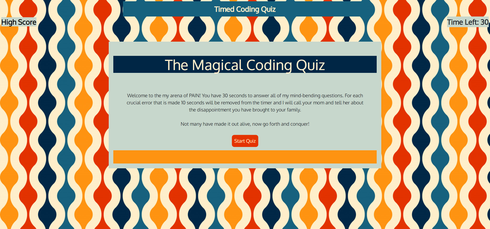

# TimedCodeQuiz
Welcome to my simple JavaScript Quiz
[My Timed Code Quiz](https://ashleywhaley.github.io/TimedCodeQuiz/)

## Languages 

JavaScript was the main language of the project which made the page completely interactive. I created an array of super hard questions and by manipulating the DOM was able to display each question in sequence. 

CSS was used to make this site more stylish like the creator :wink:

HTML was the starting point and bootstrap was used as an accent. 

## Description 

When page is loaded, home screen is introduced with the quiz rules and a start button.

Once start button is clicked, home screen is hidden and the 10 questions are shown in order. The options are displayed and once one is chosen the user is advanced to the next question. If chosen wisely no time will be deducted if incorrect 5 seconds will be taken off the 30 second timer. 

Once user has either ran out of time or finished quiz, they are prompted to enter in initials. This is then saved to the honored high score list that is stored on the local storage. 

*Admittedly there is still bugs with the high score link. I will continue to debug.

